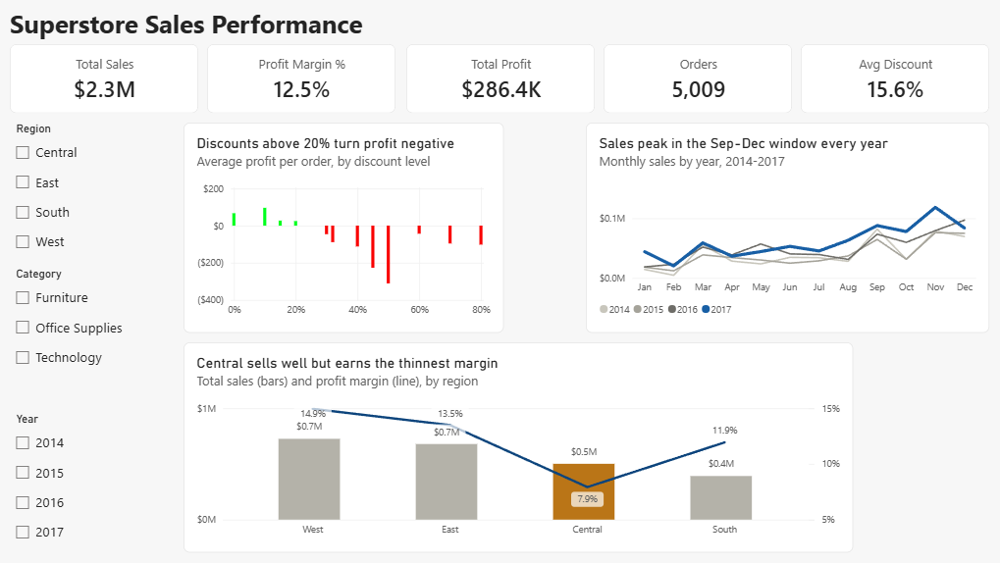

# Superstore Sales & Profit Analysis

SQL analysis of the Sample Superstore dataset (~9,994 order line items) in PostgreSQL, looking at
what drives profit and where the business loses money.

## Findings

1. **Discounts above 20% lose money** — average profit crosses zero between 20% and 30% discount,
   across every category. Recommendation: cap discounts at 20%.
2. **The Central region's low margin is a discounting problem** — Central runs a 7.9% margin (half
   the other regions) and is the only region whose *average* discount (24%) sits above the 20%
   break-even line.
3. **Peak season (Sep/Nov/Dec) is organic — protect margin, don't discount into it** — those three
   months are the top sellers every year, at normal (~15%) discount levels. Demand is a business
   budget cycle, not price-driven, so capture it with inventory and awareness campaigns rather than
   deeper discounts.

Full write-up with tables and caveats in [FINDINGS.md](FINDINGS.md).

## Power BI Dashboard

An interactive dashboard built on the same data, visualizing the three findings above for a
sales-leadership audience. Connected directly to the PostgreSQL `superstore` table, modeled with a
Calendar date dimension and DAX measures, with every figure reconciled back to the SQL results.



**What it shows**

- KPI row — total sales, profit, margin, orders, and average discount at a glance.
- *Discounts above 20% turn profit negative* — average profit per order by discount level, red below zero.
- *Central sells well but earns the thinnest margin* — sales (bars) vs. margin (line) by region, Central highlighted.
- *Sales peak in the Sep–Dec window every year* — monthly sales per year, 2017 highlighted against prior years.
- Region / Category / Year slicers filter the whole page.

**How it's built**

- Source: the PostgreSQL `superstore` table, imported via Power Query (types set, columns cleaned).
- Model: a star schema — a dedicated Calendar date table (marked as the date table) joined to the fact table.
- Measures: DAX — Total Sales, Total Profit, Profit Margin (via `DIVIDE`), Orders (distinct order count), Avg Discount, Avg Profit.
- Validation: KPIs and chart totals reconcile to the SQL analysis, which is the ground truth.

The `.pbix` is in `powerbi/`. It opens standalone from an imported snapshot; refreshing it needs the
local `superstore` database (see Reproduce below).

## Repo layout

```
data/     Sample - Superstore.csv (Kaggle: vivek468/superstore-dataset-final)
sql/      01_schema.sql  02_load.sql  03_discount_vs_profit.sql
          04_region_profitability.sql  05_seasonality.sql
powerbi/  Superstore Dashboard.pbix, screenshots/
```

## Reproduce

```bash
createdb superstore
psql -d superstore -f sql/01_schema.sql
psql -d superstore -f sql/02_load.sql   # \copy expects to run from the repo root
```

Then run the analysis scripts in `sql/`.

## Tools

PostgreSQL 18, pgAdmin, Power BI Desktop.
